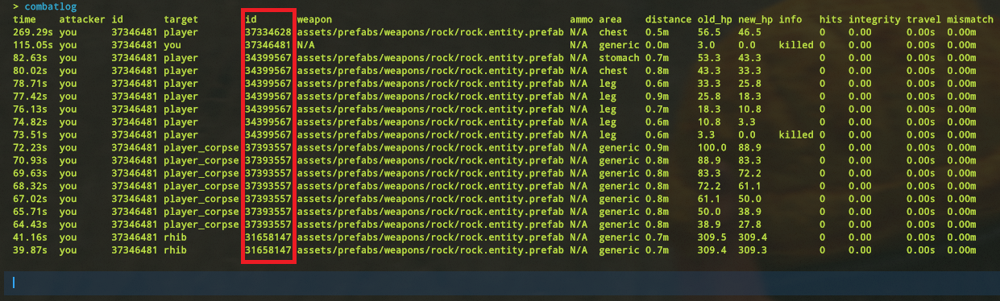

# Getting Entity ID's

You can get entity ID's by hitting the entity in-game and then using your `combatlog`

You can also get the Entity Id's though the smart device pairing notifications received through FCM messages, see here for that:


[.](./)


